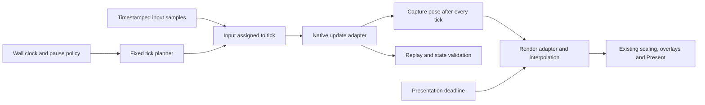

# Separating simulation rate from presentation

Research date: 2026-09-18. Source snapshot:
`b57f7b115f3da81a5ece8fc4b853be6aff2fc066` (`TH14: sub-step the lasers`).

This is a source audit and scheduling experiment, not an implemented runtime change.
It covers the committed TH10–14 backend and the separate New Classic backend. Local
unmerged patches and bundles were not applied or evaluated as part of the implementation.
Some older architecture notes describe earlier feature sets; the source at this commit
is the authority for the observations below.

## Recommendation

An opt-in, fixed-rate simulation mode is feasible and worth prototyping in TH12. Replacing
the default behavior across all games immediately has an unfavorable risk/reward ratio.

The main reward is a single gameplay timeline across different displays: the same
simulation revision, settings and per-tick input could produce the same result at 60,
144 or 360 presented frames per second. The main cost is making rendering and input
independent of that timeline without breaking native engine behavior or existing replays.
The accumulator itself is a small part of the work.

The existing x86 scheduler does **not** have a large alternating-step problem merely
because 144 is not divisible by 60. Its steps are already nearly uniform. This proposal
should be justified by display-independent gameplay, replay validation and explicit timing
contracts, rather than by treating current 144 Hz support as fundamentally broken.

New Classic is a separate case: its optional projectile sub-stepping has a different live
schedule, with uneven integration slices at non-multiple refresh rates. That merits a
bounded investigation even if the larger architecture project is deferred.

## What “fixed timestep” would mean here

The proposed model has three clocks:

| Work | Clock | What remains native |
| --- | --- | --- |
| Scripts, spawning, discrete timers and frame-scoped actions | 60 native frames/s | Existing callback order and frame gates |
| Audited movement and collision paths | One fixed rate, initially compare 240 and 480 ticks/s | Existing game-specific sub-step patches |
| Drawing, scaling, overlays and presentation | Display/presentation schedule | Existing graphics backends and most UI code |

At 240 ticks/s there are exactly four physics ticks per native frame; at 480 there are
eight. Their steps are exactly representable as `0.25f` and `0.125f` in the engine's
**game-frame units**. This is also why neither the example's 100 Hz nor an arbitrary
floating-point `dt` is the natural first choice here. The game's own slow-motion factor
must still apply; wall-clock scheduling and game-speed scaling are different concerns.

An accumulator runs as many fixed updates as are due. Rendering then interpolates saved
states using the remaining fractional time. Rendering only the newest state, as in the
short loop in the question, can still show uneven movement when the clocks do not align.
An overload policy is needed so catch-up does not consume all available time.
[Gaffer's fixed-timestep article](https://gafferongames.com/post/fix_your_timestep/).

Fixed `dt` is not sufficient for determinism: initial state, inputs, random-number use and
numerical behavior also matter. For this mod, the initial target should be repeatability
for the same executable, simulation revision and settings with identical per-tick input.
Cross-platform bit identity is a further validation task.
[Gaffer's determinism discussion](https://gafferongames.com/post/deterministic_lockstep/).

This would remain an HFR gameplay variant. It would not prove stock-game score/replay
equivalence, eliminate every possible tunnelling case, or turn every system into 480 Hz
logic. Unaudited callbacks must remain at 60 Hz.

## What exists already

### The x86 backend is partially decoupled

[`src/core/timing.c`](../src/core/timing.c) already separates `g_logic_rate` from
`g_refresh`. Normal play chooses the presentation rate as the simulation rate; replay
playback can instead use the recording's rate. `ticks_for_slot()` distributes zero, one
or multiple simulation ticks over presentation slots.

`advance_tick()` chooses multiples of 1/256 of a game frame, with an integer remainder,
so a complete one-second cycle sums to exactly 60 game frames. At rates such as 144, a
tick may cross a native frame boundary; a major tick is the first tick starting in the
next frame. This is not “divide each native frame into either two or three equal parts.”

[`src/core/frame.c`](../src/core/frame.c), `hfr_frame()`, runs extra ticks through
`update_only_tick()`, then calls the original frame function for the final update and
draw. It can suppress the update when only a draw is needed. A wall-clock deficit adds
or removes a tick with hysteresis, and large discrepancies reset the wall-clock anchor.
It is not an accumulator that drains all due fixed steps.

[`src/core/limiter.c`](../src/core/limiter.c) already reproduces the native context and
cleanup needed for update-only calls. All current TH10–14 profiles supply the five
addresses that enable this path. That is valuable plumbing, but it does not prove that
arbitrary batches of updates are equivalent to updates interleaved with drawing. The
original frame function can also own work outside the replaced update list.

[`src/backends/update_runner.c`](../src/backends/update_runner.c) preserves callback
ordering, pause/stop behavior and per-game calling conventions. `MODE_FRAME` runs only
on native frame boundaries; `MODE_SUB` runs each simulation tick. Those distinctions and
the emitted game-specific timer/movement patches should be retained.

### Rendering is the largest missing abstraction

[`src/core/interpolation.c`](../src/core/interpolation.c) tracks enemy positions at
native frame boundaries and writes interpolated sprite positions at the end of the
update runner. It is not a general previous/current physics-state snapshot system.
TH11–13 currently supply `place_enemy`; TH10 and TH14 do not.

There is no common physics-tick history for players, bullets, items, shot geometry and
lasers. Existing sprite/draw interception in [`src/game_profile.h`](../src/game_profile.h)
and [`src/core/dimming.c`](../src/core/dimming.c) provides useful hook points, but the
profile does not describe general pose capture or object generations. A draw hook alone
does not reconstruct the two latest simulation states after several updates without a draw.

New Classic has reusable pose mathematics in
[`src/backends/fixed_history.h`](../src/backends/fixed_history.h), but its live `sprite()`
hook in [`src/hfr64.c`](../src/hfr64.c) captures state during drawing, indexed by native
ticks. Missed native ticks and same-tick position changes can invalidate history. That
capture policy cannot simply be transplanted into a batched physics loop.

### Input and replays provide a foundation, not the full contract

[`src/core/input.c`](../src/core/input.c) polls fresh movement/focus on minor ticks,
preserves the native raw input structure, and records the bits each tick actually used.
Shooting, bombs and other frame-scoped edges retain native timing. Its joystick worker
keeps the latest reading, without timestamped history.

Several catch-up ticks executed together therefore query present input rather than the
input that existed at each tick's logical time. Fixing the physics rate alone does not
make a live input timeline independent of presentation cadence. Replay determinism with
a supplied tick-input stream and faithful live input capture are separate requirements.

[`src/core/replay.c`](../src/core/replay.c) already records the simulation rate, revision,
sub-step/input flags, node mask and per-tick movement/focus extension. TH10 has custom
save/load adapters in [`src/games/th10.c`](../src/games/th10.c); its lack of the generic
save/load address fields does not mean it lacks this support. TH11–13 use shared hooks.
At this snapshot, TH14 has replay callback addresses but not the complete input/replay
extension integration. New Classic has no equivalent HFR replay extension.

## Scheduling measurements

[`tools/research/fixed_step_timing.c`](../tools/research/fixed_step_timing.c) executes
the actual x86 timing code. It also executes New Classic's clock/slice helpers using a
small model of the projectile call order in `update_first()`. The table shows the amount
of **simulation time integrated by a step**, not measured wall-clock time between game
collision checks.

| Requested rate | x86 minimum–maximum step, ms | New Classic modeled projectile slice, ms |
| ---: | ---: | ---: |
| 144 | 6.901042–6.966146 | 1.388889–12.500000 |
| 165 | 6.054688–6.119792 | 1.515152–10.606061 |
| 240 | 4.166667–4.166667 | 4.166667–4.166667 |
| 360 | 2.734375–2.799479 | 2.777778–2.777778 |
| 480 | 2.083333–2.083333 | 2.083333–2.083333 |

The probe covers 60, 120, 144, 165, 240, 360, 480 and 960 Hz. Each x86 one-second
sequence produced 60 major ticks and exactly 60 game frames. Each modeled New Classic
sequence also accounted for 60 game frames. The 60 Hz New Classic row is an accounting
control; the live optional sub-step path is disabled at 60 Hz.

These measurements have two implications:

1. Counting two or three samples inside successive 60 Hz windows does not, by itself,
   establish an 8.33 ms worst-case step at 144 Hz. The x86 scheduler's actual largest
   step is about 6.966 ms. Individual collision paths still need auditing: not every
   callback or check necessarily runs on every scheduler tick.
2. New Classic's optional projectile path warrants separate analysis. On a major update
   it finishes the outgoing frame, runs native logic, and moves the player to the new
   phase. It does not then advance projectiles to that new phase. The next minor update
   can consequently integrate a larger slice. The model reproduces that call order;
   it does not establish that players will notice an error or that a one-line change is safe.

The tested `substep_advance()` helper in
[`src/backends/substep.h`](../src/backends/substep.h) is **not called by the live New Classic
update loop** at this commit. Its callers are in `tools/test_fixed.c`; production uses
`fixed_clock_step()` and `subtick_slice()`. Tests of that helper are not evidence about
the live projectile cadence. Before changing the latter, check player/projectile collision
order, frame transitions, native fast-forward and replay behavior.

To reproduce from the repository root in PowerShell:

```powershell
$env:PATH = 'C:\msys64\mingw64\bin;' + $env:PATH
New-Item -ItemType Directory -Force build/fixed-step-research | Out-Null
gcc -std=c11 -O2 tools/research/fixed_step_timing.c -o build/fixed-step-research/timing_probe.exe
if ($LASTEXITCODE -ne 0) { throw 'Timing probe compilation failed' }
& ./build/fixed-step-research/timing_probe.exe
if ($LASTEXITCODE -ne 0) { throw 'Timing probe accounting failed' }
```

No game is loaded. New Classic is modeled with ideal presentation spacing and an active
projectile callback, without pauses, stalls or transitions. This is not a performance,
collision-correctness, input-latency or replay-determinism benchmark.

## Proposed architecture and implementation work

Keep the implementation single-threaded initially, with shared clock/input/history
primitives and backend-specific stepping and rendering adapters. The x86 unity build and
x64 runtime can compile the same pure C helpers without pretending their native engines
have the same layout or calling convention.



| Area | Concrete change | Reuse and relative effort |
| --- | --- | --- |
| Clock and settings | Give presentation cap and physics rate independent ownership; integer tick index; fixed native-boundary phase; explicit pause/stall policy | Reuse timing concepts; small shared core, medium integration |
| Update execution | Make zero/one/many updates per draw a supported contract; preserve context, cleanup, list mutations and scene return codes | Existing runner and update-only path; medium to high audit effort |
| Render history | Capture every physics tick; draw using history without changing authoritative state | Existing hooks and pose math help; large effort, with per-engine reverse engineering |
| Input | Timestamp samples/events, assign them to logical ticks, define late-event and edge policies | Existing mappings, recording and joystick worker help; medium to high effort |
| Replay | Version new simulation behavior and input policy; retain a real old-playback path | Existing x86 extensions help; medium to high effort; New Classic needs more |
| Compatibility and validation | Prove batch equivalence, drawing purity, replay consistency and acceptable cost | Existing isolated tests help; substantial game-level work |

### Clock and native frame contract

Separate the presentation deadline from simulation time. Use a fixed physics rate for an
entire run and replay. Changing monitors, an F11 presentation setting or a device reset
must not restart the physics phase, change input indexing, or change the gameplay rate.
Relevant current call sites are `recompute_rate()`, `replay_check()`, D3D9 `after_device()`
and `hfr_ui_apply_pending()`.

Use the existing major/minor classification at a fixed multiple of 60. Preserve callback
ordering at the boundary, not just the number of calls. Some animation managers are
`MODE_SUB` too: increasing the rate affects their execution cost and potentially hidden
counters, not only bullet movement. Moving cosmetic work to another clock is a separate
audit, particularly if scripts consume randomness or alter gameplay-visible state.

For overload, bound work per outer iteration. Retain simulation debt, or explicitly enter
a defined slowdown/re-anchoring policy; do not silently enlarge the physics `dt` or skip
authoritative ticks. Map input consistently through that policy. Pauses, loading and
focus changes need deliberate reset rules, rather than accumulating minutes of catch-up.

Do not initially replace the entire native frame function with a hand-written draw loop.
First establish which housekeeping, audio, cleanup and external hooks belong to each
native update, outer iteration or presentation. The existing final-update-plus-native-frame
path is a useful starting point for a diagnostic prototype.

### Rendering and latency

Capture poses after **each** physics tick, including every update in a catch-up batch.
Use stable object identity with generation/lifetime handling, not an address alone.
Define behavior for births, deaths, teleports, reused slots, animation/script restarts,
parent/child sprite transforms, laser endpoints/curves and the stage camera.

Rendering must not feed interpolated values back into physics. Prefer derived draw data;
where native render code requires temporary writes, restore them before the next update
and verify relevant authoritative state is unchanged. A raw D3D vertex hook does not by
itself retain object identity or describe every non-sprite primitive.

Conventional interpolation between the latest two completed physics states displays a
timeline one physics step behind wall time: 4.17 ms at 240 Hz, 2.08 ms at 480 Hz. These
are not predictions of the change in total input-to-photon latency relative to today's
mod. Some existing paths already interpolate; New Classic also predicts in sub-tick mode.

There is a further multi-rate issue: ECL enemies and other retained 60 Hz systems do not
gain 480 Hz pose samples. Smoothing those can still involve approximately one native
frame of visual delay, or prediction with its own error risk. Choose a coherent visual
time policy and measure visual/hitbox alignment. Do not simply apply another interpolation
layer on top of existing enemy smoothing or claim every sprite is delayed only 2 ms.

### Input and actual execution latency

Specify which timestamped sample is used for each physics tick and what happens when an
event arrives after that tick has already executed. Preserve the distinction between held
movement/focus and once-per-native-frame actions. Record the input actually consumed,
including native-boundary input; solve focus loss, device changes and menu capture too.

A timestamped OS input collector may be useful, but do not call the game's native polling
routine from a worker without auditing its memory access. Polling timestamps describe
when a state was observed, not the unknowable exact time of a physical button transition.

Also, **480 logical ticks/s does not guarantee 480 evenly spaced executions per real second**.
If the main thread blocks in a 60 Hz `Present`, several ticks will run in a burst afterward.
Recorded tick-input can still replay consistently, but live reaction latency needs separate
work on input collection and presentation pacing. Keeping physics off the rendering thread
is not required for fixed-step correctness, and is not a safe shortcut in these engines.

Native globals, sprite pools and callbacks would need synchronization or ownership rules.
Graphics APIs add constraints: D3D9 device reset/window operations have thread affinity;
D3D11 immediate contexts must not be used concurrently and DXGI presentation should use
the same thread. Neither API makes the game's memory thread-safe.
[D3D9 documentation](https://learn.microsoft.com/en-us/windows/win32/direct3d9/multithreading-issues),
[D3D11 documentation](https://learn.microsoft.com/en-us/windows/win32/direct3d11/overviews-direct3d-11-render-multi-thread-intro).

### Replay and other mods

Give the new behavior a simulation revision that identifies the scheduler/input rules as
well as the fixed rate and gameplay settings. Presentation rate should not be an
authoritative replay input. The existing x86 rate field can be reused; not everything
needs a new file format.

A revision bump alone does not preserve old recordings. Keep the legacy stepping behavior
for old HFR replays, or explicitly require the matching older runtime when unsupported.
Do not silently reinterpret a legacy recording using the new loop. Stock replays must
continue to use their native 60 Hz behavior. New Classic needs a replay extension before
offering the same reproducibility promise for optional sub-tick gameplay.

There is a concrete thprac dependency in the current runner: the normal entry thunk jumps
to the original runner's `ret`, keeping thprac's UI hook reachable. Extra update-only calls
deliberately call `hfr_runner()` directly and bypass that tail. Running the tail every
physics tick could generate too many UI frames; bypassing it on every tick could hide
thprac again. Preserve the existing once-per-outer-frame hook behavior, including draws
with zero physics updates. THRotator, thcrap and the existing scaling/presentation hooks
also belong in the integration matrix.

## Risk/reward assessment

| Direction | Expected reward | Risk / cost | Assessment |
| --- | --- | --- | --- |
| Keep current x86 default; investigate New Classic cadence separately | Low disruption; resolves a narrower timing concern if confirmed | Low to moderate, with gameplay checks for any cadence change | Best short-term maintenance option |
| Opt-in fixed-rate TH12 prototype, initially diagnostic | Tests whether updates can be batched independently of drawing | Moderate; visibly rough output is acceptable only for diagnostics | Best next research investment |
| Complete fixed-rate mode with snapshots, input policy and versioned replays | Display-independent simulation; easier repeatability checks; consistent chosen integration resolution | High initial engineering effort, manageable through staged gates | Worth pursuing if these are project goals |
| Immediate all-game replacement or multithreaded engine rewrite | Broad theoretical benefit before it is measured | Very high regression and compatibility risk | Poor current tradeoff |

At 480 Hz, high-rate callback invocations would be approximately 3.33 times today's 144 Hz
count, twice today's 240 Hz count, and 1.33 times today's 360 Hz count. This is **not** a
prediction of total CPU usage: native 60 Hz work and rendering have different costs, and
snapshot capture adds new work. Dense scenes must be measured before selecting a default.

240 Hz costs less, but can lower physics/input resolution for someone currently using
360 Hz. 480 Hz is a useful higher-quality candidate, not an automatic optimum. To offer
the same gameplay across monitors, choose one canonical rate for a simulation revision;
optional alternative rates are distinct simulation configurations. Do not adapt physics
rate to the monitor or CPU load in the middle of a run.

The visual improvement over a working 144/240/360 Hz setup may be modest. The strongest
benefit is a clear, reproducible gameplay contract. A mandatory high physics rate on a
60 Hz display would also change today's near-stock expectation there, so preserve an
explicit native/legacy path and start with opt-in behavior.

## Staged plan and acceptance gates

1. **Establish an engine-level baseline in TH12.** Feed a fixed tick-input stream, capture
   canonical gameplay state after every tick, and compare one-update/one-draw execution
   against batches with zero, one and multiple draws. Include RNG, timers, state flags,
   lifecycle and script state, not only positions. Exclude addresses, padding and purely
   graphics state from comparisons. Investigate the first divergence. If batching changes
   gameplay, fix that dependency before adding interpolation.
2. **Introduce an opt-in clock/configuration boundary.** Compare fixed 240 and 480 using
   existing update adapters. Keep the legacy mode intact. Test the planner, major/minor
   boundaries, paused clocks and overload rules in isolation, then verify the same tick
   sequence in the real game. This prototype is not release-ready solely because it runs.
3. **Add pose capture and rendering adapters.** Start with player, bullets and enemies,
   then cover items, shots, lasers and other visible systems needed for coherent play.
   Validate births/deaths, teleports and draw-state restoration. Decide how 60 Hz channels
   align with the physics timeline before describing latency benefits.
4. **Complete input and replay semantics.** Add timestamped input assignment, native-edge
   handling and simulation-version dispatch. Test new and legacy replay paths, stock
   recordings, stage restarts and live capture. Measure input latency separately from
   logical simulation frequency.
5. **Benchmark and expand only after the first game passes.** TH11 and TH13 are plausible
   next targets. TH10 has a different speed model and missing enemy placement adapter;
   TH14 has ongoing input/replay/pose work. New Classic requires a separate native adapter
   and replay solution. Reuse the pure core and test contracts across all of them.

For each migrated backend, vary presentation through 60, 120, 144, 165, 240, 360, 480
and 1000 Hz, plus irregular cadence and deliberate stalls. With identical per-tick input,
the authoritative state sequence must agree regardless of draw grouping. Check actual
game outcomes, not just the pure scheduler's tick counts.

Include pause, focus loss, device reset, monitor changes, F11 capture, stage transitions,
death, bombs, continues, slow motion and replay speed controls. Preserve external UI hooks
on zero-update and multi-update draws. Cover supported executable variants and later
repeat integration checks under Proton and with supported injected mods.

Measure update, snapshot, draw and blocked-Present time separately in dense scenes, with
tail latency as well as averages. Verify tap/edge input around tick boundaries and during
catch-up. Gate the new mode by backend capabilities; missing pose/input/replay support
must not silently become a partial determinism claim.

The existing harnesses described in [TESTING.md](TESTING.md) establish useful isolated
properties, patch installation and emitted-code behavior. They do not execute whole
stages, prove draw independence, or establish replay determinism in the actual engine.
New Classic's current draw guard is a useful starting pattern, but hashes only selected
ranges and is not a complete proof of rendering purity.

## What this research does not establish

- Whether the game-level state sequence is currently invariant under all update/draw batches.
- Which collision paths still have native-frame-only decisions or hidden state dependencies.
- Actual CPU cost, input-to-photon latency or perceptual benefit of a fixed 240/480 Hz mode.
- Full replay correctness for any proposed new scheduler or cross-platform numerical identity.
- A reliable calendar estimate: per-engine pose extraction and the first state-divergence
  investigation are the largest unknowns. Treat this as several staged changes, not a
  small frame-loop refactor.

No production code, installed DLL or game files were changed for this research. No further
user testing is needed to decide whether to start the bounded prototype; game testing becomes
necessary once there is a concrete candidate to validate.
